# Stock Analysis Report: AAPL

## 1. Introduction and Overview
This report presents an analysis of stock data for the ticker symbol **AAPL** from **2020-01-01** to **2021-01-01**. It covers data loading, visualization, deep learning forecasts, and forecast evaluation metrics.

## 2. Definitions and Explanations
### 2.1 Basic Stock Metrics
- **Close Price**: The final trading price of the stock for the day. This value is critical for gauging market sentiment at the end of trading sessions.
- **Volume**: The total number of shares traded during a given period. High volume often signals increased market interest or volatility.

### 2.2 Time Series and Statistical Analysis
- **Volatility**: A measure of how much the stock price fluctuates over time, calculated over intervals such as 30-day and 90-day periods.
- **Seasonal Decomposition**: A process that splits a time series into trend, seasonal, and residual components to better understand underlying patterns.
- **Dickey-Fuller Test**: A statistical test used to determine if a time series is stationary, which is a necessary condition for many forecasting models.

### 2.3 Technical Indicators
- **Moving Averages**: Techniques that smooth out short-term fluctuations to reveal longer-term trends. Common periods include 30, 90, 120, and 365 days.
- **Dividend Yield**: The ratio of a company�s annual dividend relative to its share price, used to assess the income potential of an investment.

### 2.4 Forecasting Models and Evaluation Metrics
- **LSTM (Long Short-Term Memory)**: A type of recurrent neural network that captures long-term dependencies, used here to forecast closing prices.
- **GRU (Gated Recurrent Unit)**: A streamlined version of LSTM with fewer parameters, offering similar forecasting capabilities with improved computational efficiency.
- **Theil's U Statistic**: A metric that compares the performance of the forecast model to a naive forecast. Lower values indicate better performance.
- **Naive Forecast**: A baseline forecasting method that simply carries forward the last observed value as the future prediction.
- **Cross-Validation**: A method to assess model generalizability by partitioning data into training and validation sets.
- **Backtesting**: The process of evaluating a forecasting model using historical data to simulate its performance in real-world scenarios.

## 3. Data Loading and Preparation
The dataset was obtained from Yahoo Finance for the ticker symbol **AAPL** between **2020-01-01** and **2021-01-01**. Missing values were filled using interpolation to create a continuous time series for analysis.

## 4. Visualizations and Detailed Results

### 4.1 Stock Prices
**Description**: This plot displays the daily closing prices over the analysis period.
**Interpretation**: Fluctuations in the closing price indicate overall market trends, investor sentiment, and potential support/resistance levels.
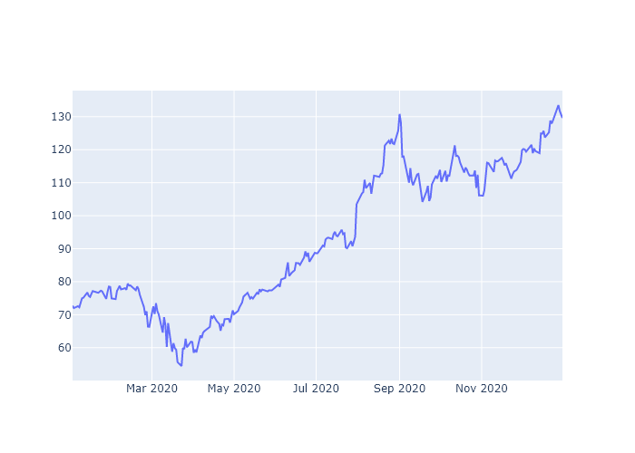

### 4.2 Trading Volume
**Description**: This chart shows the volume of shares traded each day.
**Interpretation**: High trading volume may signal increased market interest or impending price movements.
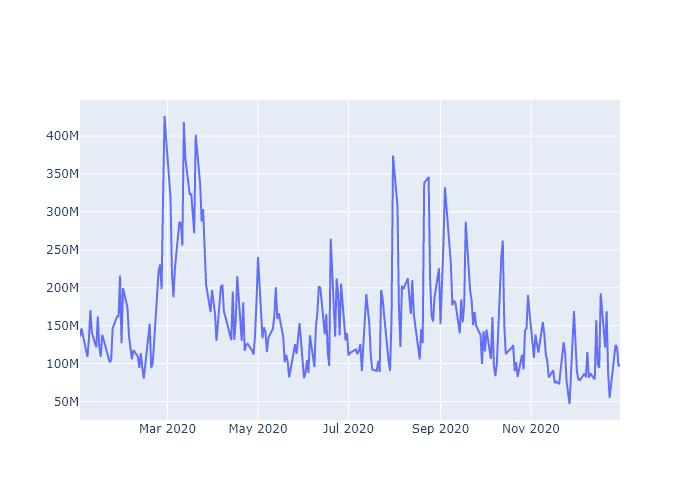

### 4.3 Volatility
**Description**: This visualization illustrates the stock's volatility over 30-day and 90-day intervals.
**Interpretation**: Volatility is a key risk metric; higher volatility implies greater uncertainty and risk.
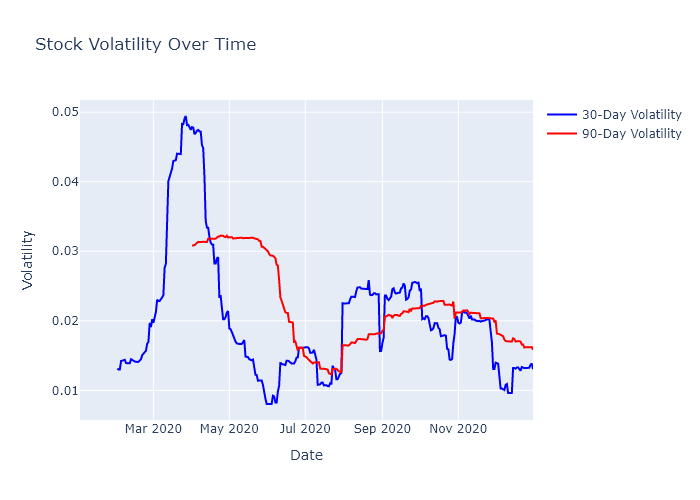

### 4.4 Seasonal Decomposition
**Description**: The seasonal decomposition plot breaks the stock price data into trend, seasonal, and residual components.
**Interpretation**: This helps identify underlying patterns, cyclical behavior, and irregular fluctuations.
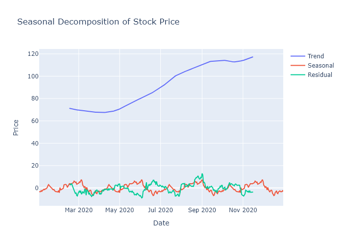

### 4.5 Dickey-Fuller Test (Differenced Close Prices)
**Description**: This plot shows the differenced close prices used for assessing the stationarity of the time series.
**Interpretation**: A stationary time series is crucial for reliable forecasting; the Dickey-Fuller test helps determine stationarity.
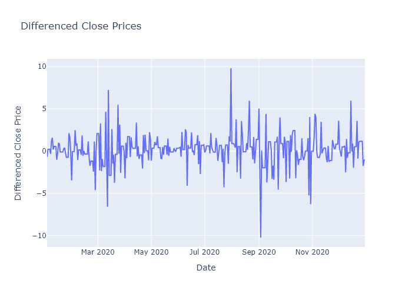

### 4.6 Moving Averages
**Description**: This plot overlays several moving averages (30, 90, 120, and 365 days) on the closing price data.
**Interpretation**: Moving averages smooth out short-term fluctuations, clarifying the overall trend in stock prices.
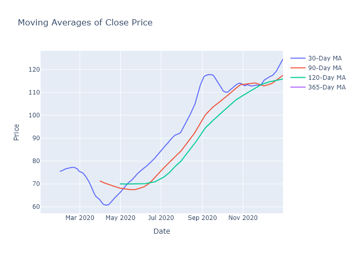

### 4.7 Dividend Yield
**Description**: This visualization displays the dividend yield over time.
**Interpretation**: Dividend yield is an important metric for income-focused investors, indicating the cash return on investment relative to the stock price.
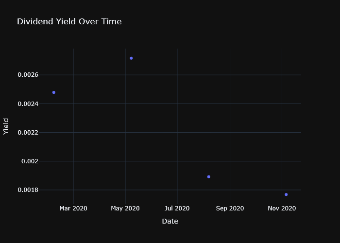

## 5. Deep Learning Model Forecasts
The deep learning models (LSTM and GRU) were trained on 90% of the data to forecast the stock's closing price.

### 5.1 LSTM Model Forecast
**Metrics:**
- **RMSE**: 3.6039
- **MAPE**: 0.0240
- **MAE**: 2.8964
- **R2**: 0.5727
**Visualization:** The plot below compares the LSTM model's predictions to the actual stock prices.
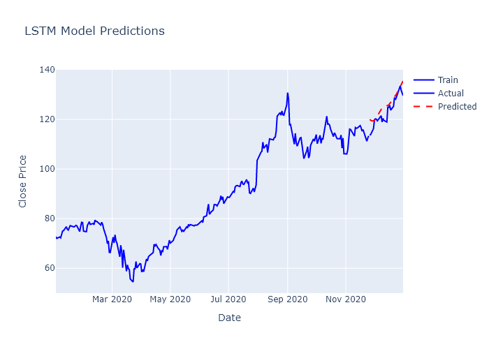

### 5.2 GRU Model Forecast
**Metrics:**
- **RMSE**: 2.1330
- **MAPE**: 0.0131
- **MAE**: 1.6265
- **R2**: 0.8503
**Visualization:** The plot below shows the GRU model's predictions alongside the actual values.
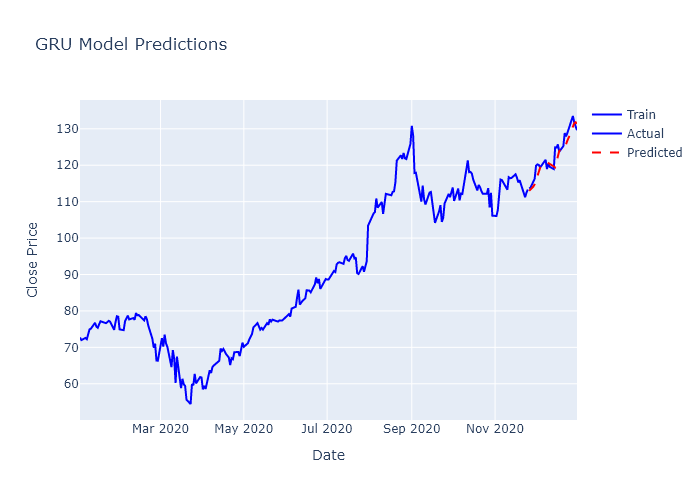

## 6. Forecast Evaluation
### 6.1 Theil's U Statistic
- **Theil's U**: 2.2536
**Interpretation:** A lower Theil's U value indicates that the forecasting model performs better than the naive forecast.

### 6.2 Cross-Validation (Naive Forecast)
**Description:** This plot shows the results of cross-validation using a naive forecasting approach.
**Interpretation:** Cross-validation assesses the consistency of the naive forecast across different data segments.
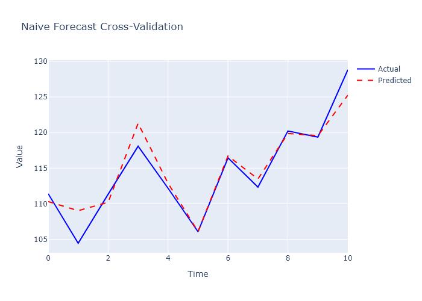

### 6.3 Backtesting Forecast (Naive Forecast)
**Description:** The backtesting chart evaluates forecast performance using a rolling window on historical data.
**Interpretation:** Backtesting helps verify that the forecast model's performance is robust over time.
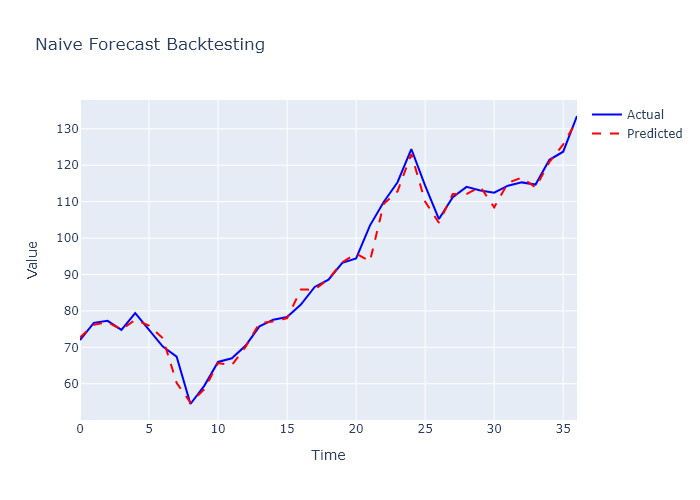

## 7. Conclusion
This report summarizes the key findings from the stock analysis. The detailed visualizations reveal important trends and patterns in the stock's performance, while the deep learning models offer forecasts benchmarked against naive methods. The comprehensive definitions and explanations provided throughout this report are intended to assist in interpreting the analysis results and making informed investment decisions.